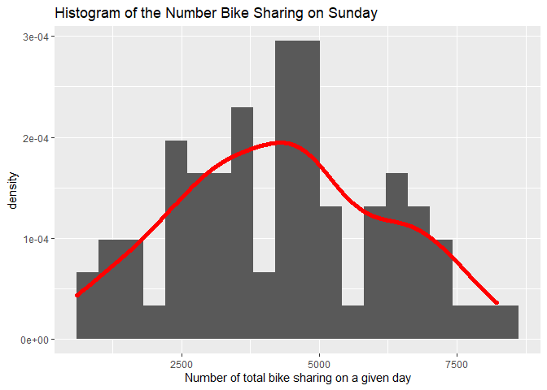
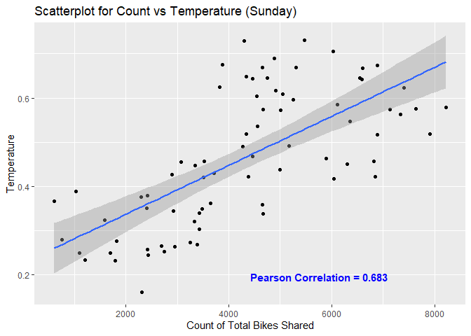
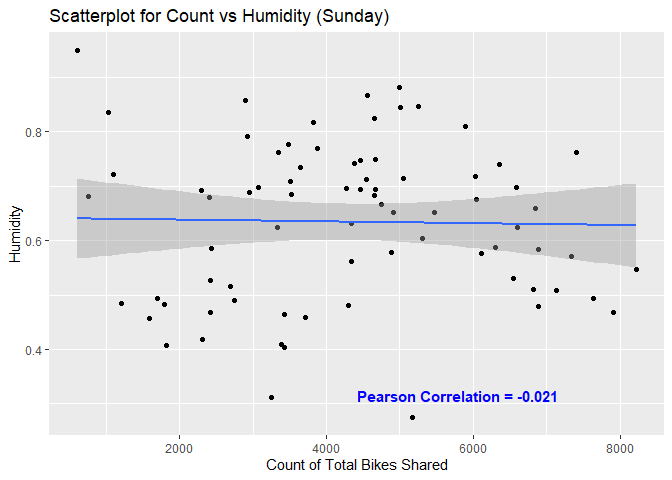
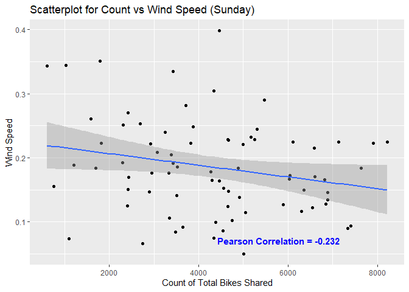
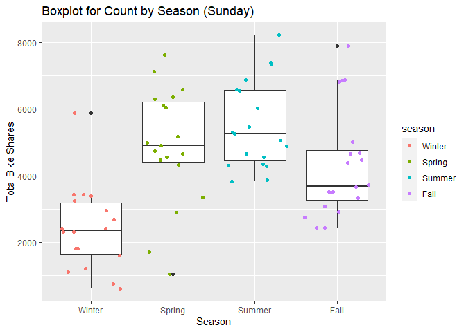
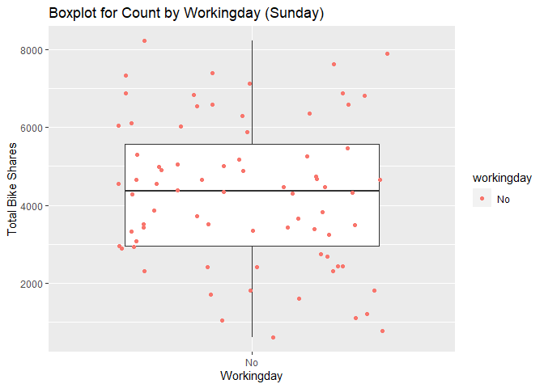
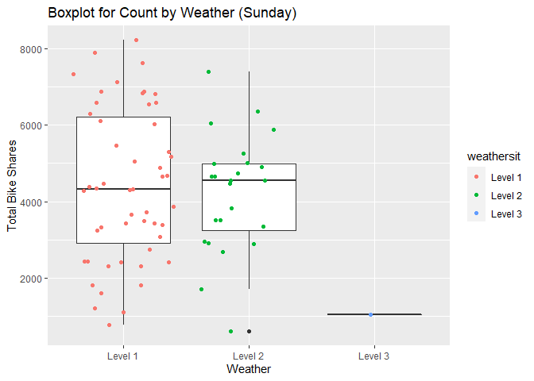

ST558 Project 2
================
Maggie Feng and Vito Leonardo
July 11, 2021

# Introduction

In this report, we will be analyze the day.csv bike sharing data set. We
will start by summarizing the data to get an idea of the data set. Then
we will try to predict the number of users using predictive models. The
data set contains the count of bike share users per day over 731 days
along with the weather and climate data associated with each day. The
response variable that we are trying to predict is the `cnt` variable
which a count of all biking sharing users (registered plus casual) in
the given day. Our goal is to predict `cnt` based on what season it is,
`season`; whether it is a working day or not, `workingday`; the weather,
`weathersit`; how the temperature feels that day, `atemp`; the wind
speed that day, `windspeed`; and the humidity, `hum`. We will predict
the count of bike shares with 4 models: 2 different linear regression
models, 1 random forest model, and 1 boosted tree model. After we fit
the 4 models, we compare the models on a test set and declare the
winner. The winner will be the model that predicts `cnt` the best; this
will be the model with the smallest Test MSE.

# Data

``` r
day <- which.max(params$day==Weekdays)

#Reading in the day dataset and filtered for Monday
Day <- read_csv("day.csv") %>% 
  mutate(weekday = weekday + 1) %>% 
  filter(weekday == day) %>%
  select(season, workingday, weathersit, atemp, hum, windspeed, cnt) %>%
  mutate(season = factor(season, c(1:4), 
                           c("Winter", "Spring", "Summer", "Fall")),
         workingday = factor(workingday, c(0, 1), c("No", "Yes")),
         weathersit = factor(weathersit, c(1, 2, 3, 4), 
                               c("Level 1", "Level 2", "Level 3", "Level 4")))

#Randomly sample from data
set.seed(123)
TrainIndex <- createDataPartition(Day$cnt, p = .7, list = FALSE)
Day.Train <- Day[TrainIndex,]
Day.Test <- Day[-TrainIndex,]
```

# Summarizations

## Quantitative Variables

Now that we read the data in, we can start summarizing and visualizing.
We will start by looking at the summary statistics of the quantitative
variables:

-   `atemp` the normalized feeling temperature in Celsius
-   `hum` the normalized humidity
-   `windspeed` the normalized wind speed

``` r
Day.Train %>% 
  select(cnt, atemp, hum, windspeed) %>%
  apply(MARGIN= 2,FUN = summary) %>%
  round(3) %>%
  kable(caption = paste0("Summary of Quantitative variables (",Weekdays[day],")"),
        row.names = TRUE) 
```

|         |      cnt | atemp |   hum | windspeed |
|:--------|---------:|------:|------:|----------:|
| Min.    |  605.000 | 0.162 | 0.276 |     0.050 |
| 1st Qu. | 2939.750 | 0.344 | 0.509 |     0.133 |
| Median  | 4357.500 | 0.456 | 0.663 |     0.178 |
| Mean    | 4308.974 | 0.465 | 0.634 |     0.186 |
| 3rd Qu. | 5571.000 | 0.598 | 0.736 |     0.226 |
| Max.    | 8227.000 | 0.731 | 0.948 |     0.398 |

Summary of Quantitative variables (Sunday)

Now that we have some summary statistics for the data, lets build some
plots. For linear regression with a continuous response, `cnt`, the
model requires the assumption that the response variable follows a
normal distribution. If our sample size is large enough, the Central
Limit Theorem will allow us to fit even if we stray slighly from
normality. We can visualize the distribution of the response with a
histogram and a density contour overlayed on top. If `cnt` follows a
normal distribution, the histogram and density contour should be bell
shaped. If it is not bell shaped, then a linear regression might not be
the best model for prediction.

``` r
ggplot(data = Day.Train, mapping = aes(x=cnt)) +
  geom_histogram(aes(y = ..density..), bins = 20) + 
  geom_density(kernel = "gaussian", size = 2, color = 'red') +
  labs(title=paste0("Histogram of the Number Bike Sharing on ",Weekdays[day]), 
       x = "Number of total bike sharing on a given day")
```

<!-- -->

Now that we have observed the shape of the sample distribution of `cnt`,
we can now explore the relationships between `cnt` and the quantitative
predictors. We will do so by creating scatterplots with `cnt` and the
three quantitative predictors of interest. The plots below will contain
the scatter plot, the linear model line, and the correlation between
`cnt` and the predictor. Predictors with a high correlation will likely
be good predictors for our models.

``` r
Cor1 <- round(cor(Day.Train$cnt,Day.Train$atemp),3)
grob1 = grobTree(textGrob(paste0("Pearson Correlation = ", Cor1), 
                          x = 0.5, y = 0.10, hjust = 0, 
                          gp = gpar(col = "blue", fontsize = 11, fontface = "bold")))

ggplot(data = Day.Train, mapping = aes(x=cnt, y=atemp))+
  geom_point()+
  geom_smooth(method = lm)+
  labs(title = paste0("Scatterplot for Count vs Temperature (",Weekdays[day],")"),
       x = "Count of Total Bikes Shared", 
       y = "Temperature") +
  annotation_custom(grob1)
```

<!-- -->

``` r
Cor2 <- round(cor(Day.Train$cnt,Day.Train$hum),3)
grob2 = grobTree(textGrob(paste0("Pearson Correlation = ", Cor2), 
                          x = 0.5, y = 0.10, hjust = 0, 
                          gp = gpar(col = "blue", fontsize = 11, fontface = "bold")))
ggplot(data = Day.Train, mapping = aes(x=cnt, y=hum))+
  geom_point() +
  geom_smooth(method = lm) +
  labs(title = paste0("Scatterplot for Count vs Humidity (",Weekdays[day],")"),
       x = "Count of Total Bikes Shared", 
       y = "Humidity") +
  annotation_custom(grob2)
```

<!-- -->

``` r
Cor3 <- round(cor(Day.Train$cnt,Day.Train$windspeed),3)
grob3 = grobTree(textGrob(paste0("Pearson Correlation = ", Cor3), 
                          x = 0.5, y = 0.10, hjust = 0, 
                          gp = gpar(col = "blue", fontsize = 11, fontface = "bold")))
ggplot(data = Day.Train, mapping = aes(x=cnt, y=windspeed))+
  geom_point()+
  geom_smooth(method=lm) +
  labs(title = paste0("Scatterplot for Count vs Wind Speed (",Weekdays[day],")"),
       x = "Count of Total Bikes Shared", 
       y = "Wind Speed") +
  annotation_custom(grob3)
```

<!-- -->

## Qualitative Variables

Our other variables of interest are qualitative:

-   `season` indicates the season:
    -   Winter
    -   Spring
    -   Summer
    -   Fall
-   `workingday` is an indicator for if the day is a workingday
    -   No = Is a holiday/weekend
    -   Yes = Is a working day
-   `weathersit` indicates the weather category
    -   Level 1 = Clear, Few clouds, Partly cloudy
    -   Level 2 = Mist & Cloudy, Mist & Broken clouds, Mist & Few
        clouds, Mist
    -   Level 3 = Light Snow, Light Rain & Thunderstorm & Scattered
        clouds, Light Rain & Scattered clouds
    -   Level 4 = Heavy Rain & Ice Pallets & Thunderstorm & Mist, Snow &
        Fog

We will create contingency tables to see how many observations fall
under each category since present observations, or the lack of, may
indicate which categories have more bike sharing uses.

``` r
#Contingency tables for each categorical variable
kable(table(Day.Train$season), caption = "Frequency by Season")
```

| Var1   | Freq |
|:-------|-----:|
| Winter |   18 |
| Spring |   19 |
| Summer |   19 |
| Fall   |   20 |

Frequency by Season

``` r
kable(table(Day.Train$workingday), caption = "Frequency by Working Day")
```

| Var1 | Freq |
|:-----|-----:|
| No   |   76 |
| Yes  |    0 |

Frequency by Working Day

``` r
kable(table(Day.Train$weathersit), caption = "Frequency by Weather")
```

| Var1    | Freq |
|:--------|-----:|
| Level 1 |   51 |
| Level 2 |   24 |
| Level 3 |    1 |
| Level 4 |    0 |

Frequency by Weather

For the qualitative data we can look at boxplots to explore each level
of the variables in relation to `cnt`. In each plot we will group by the
different levels and plot the five number summary of the `cnt` variable.
Using the plots below we will be able to see if there is a distinct
difference between the levels of the categorical factors, which would
help determine if the variable would be a good predictor for our models.

``` r
#Season
ggplot(Day.Train, aes(season, cnt)) + 
  geom_boxplot() +
  geom_jitter(aes(color = season)) +
  labs(title = paste0("Boxplot for Count by Season (",Weekdays[day],")"),
       x = "Season",
       y = "Total Bike Shares")
```

<!-- -->

``` r
#Workingday
ggplot(Day.Train, aes(workingday, cnt)) + 
  geom_boxplot() +
  geom_jitter(aes(color = workingday)) +
  labs(title = paste0("Boxplot for Count by Workingday (",Weekdays[day],")"),
       x = "Workingday",
       y = "Total Bike Shares")
```

<!-- -->

``` r
#Weathersit
ggplot(Day.Train, aes(weathersit, cnt)) + 
  geom_boxplot() +
  geom_jitter(aes(color = weathersit)) +
  labs(title = paste0("Boxplot for Count by Weather (",Weekdays[day],")"),
       x = "Weather",
       y = "Total Bike Shares")
```

<!-- -->

# Modeling

## Linear regression

A linear regression model fits explanatory variable(s) to a response
variable. The coefficients for the variables are given based on the line
that would provide the smallest number when calculating the squared
difference between the observed values to the expected values along the
line. If there is a singular explanatory variable to predict the
explanatory variable, it would be considered a simple linear regression.
If there are more than one variable, interaction terms, and/or
polynomial terms then it is considered multiple linear regression. Our
first linear regression model uses `atemp`, `season`, and the
interaction between the two variables. The second linear regression
model is an additive model selected using the `step` function which
selects the model based on the smallest AIC.

``` r
#LM model using atemp and season
lm1.fit <- lm(cnt ~ atemp*season, data = Day.Train)

#Removing workingday variable to run lm2
#Note: saturday and sunday have only one level for this factor 
Day.Train <- Day.Train %>% select(-workingday)

#LM model selected by the step function based on the AIC
lm2.fit <- lm(cnt ~ ., data = Day.Train)
lm2.fit <- step(lm2.fit, trace = FALSE, direction = "both")
```

## Random Forest

Random forests are a supervised learning algorithm that utilizes
ensemble learning to predict an outcome. It creates multiple trees from
boostrap samples. When the trees split, a random sample of predictors
are chosen from the full set of predictors and only one is selected to
be used. Finally, the average result is the prediction.

``` r
#Random forest model
p <- ncol(Day.Train)-1
rf.fit <- train(cnt ~ ., data = Day.Train, 
                method = "rf", 
                trControl = trainControl(method = "repeatedcv",
                                         number = 10,
                                         repeats = 5),
                tuneGrid = data.frame(mtry = c(1:p,sqrt(p))))
```

## Boosted Tree

Boosted trees are another supervised learning algorithm that produces
trees that grow sequentially. Each tree is fit on a modified version of
the original data. Then each tree grows from previously grown trees and
the predictions update as the trees grow.

``` r
#Boosted tree model
B <- c(500,1000,1500,2500,5000)
lambda <- c(0.01, 0.001)
d <- 1:p
min <- 1
tunegrid <- expand.grid(B,lambda,d, min)
names(tunegrid) <- c("n.trees","shrinkage","interaction.depth","n.minobsinnode")
boosted.fit <- train(cnt ~. , data = Day.Train,
                     method = "gbm",
                     trControl = trainControl(method = "cv", number = 5),
                     tuneGrid = tunegrid,
                     verbose = FALSE)
```

# Comparison

Finally, we wish to compare the four models above by their residual mean
squared error (RMSE). The model with the smallest will be selected as
the best model.

``` r
#Prediction using lm1 and extracting RMSE
lm1.pred <- predict(lm1.fit, newdata=Day.Test)
lm1.RMSE <- postResample(lm1.pred,Day.Test$cnt)[[1]]

#Prediction using lm2 and extracting RMSE
lm2.pred <- predict(lm2.fit, newdata=Day.Test)
lm2.RMSE <- postResample(lm2.pred,Day.Test$cnt)[[1]]

#Prediction using random forest and extracting RMSE
rf.pred <- predict(rf.fit, newdata = Day.Test)
rf.RMSE <- postResample(rf.pred,Day.Test$cnt)[[1]]

#Prediction using boosted tree and extracting RMSE
boosted.pred <- predict(boosted.fit, newdata = Day.Test)
boosted.RMSE <- postResample(boosted.pred,Day.Test$cnt)[[1]]

#Making a table to contain all four models and corresponding RMSE for testing data
RMSE <- data.frame( Model = c("LM1", "LM2", "RF", "Boosted"),
                    RMSE = c(lm1.RMSE, lm2.RMSE, rf.RMSE, boosted.RMSE))
kable(RMSE)
```

| Model   |      RMSE |
|:--------|----------:|
| LM1     |  968.1585 |
| LM2     | 1314.1650 |
| RF      | 1049.8280 |
| Boosted | 1088.4094 |

The model with the lowest RMSE is Linear Model 1 with an RMSE of 968.16.
Linear Model 1 is the **winner** for Sunday’s data!
